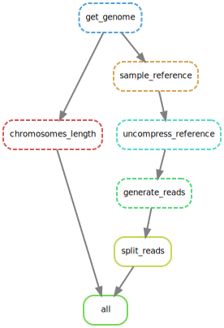

```{r setup, include=FALSE}
rm(list = ls()) ; invisible(gc()) ; set.seed(42)
library(knitr)
library(kableExtra)
if(knitr:::is_html_output()) options(knitr.table.format = "html") 
if(knitr:::is_latex_output()) options(knitr.table.format = "latex") 
library(tidyverse)
theme_set(bayesplot::theme_default())
opts_chunk$set(echo = F, message = F, warning = F, fig.height = 6, fig.width = 8,
               cache = T, cache.lazy = F)
```

Development of a [`singularity` & `snakemake`](https://github.com/sylvainschmitt/snakemake_singularity) workflow to generate *in silico* mutations.

# Summary

# Reference

## Get

```{python, eval=F, echo=T}
rule reference_get:
    output:
        "data/reference.fa.gz"
    log:
        "logs/reference_get.log"
    benchmark:
        "benchmarks/reference_get.benchmark.txt"
    threads: 4
    shell:
        "wget {config[reference]} -O {output}"
```

## Statistics

```{python, eval=F, echo=T}
rule reference_stats:
    input:
        "data/reference.fa.gz"
    output:
        "data/reference.stats.txt"
    log:
        "logs/reference_stat.log"
    benchmark:
        "benchmarks/reference_stat.benchmark.txt"
    threads: 4
    singularity: 
        "oras://registry.forgemia.inra.fr/gafl/singularity/bioawk/bioawk:latest"
    shell:
        "bioawk -c fastx '{{ print $name, length($seq) }}' < {input} > {output}"
```

```{r refStats}
read_tsv("data/reference.stats.txt", col_names = c("name", "length")) %>% 
  filter(grepl("Chr", name)) %>% 
  mutate(sel = ifelse(name == yaml::read_yaml("config/config.yml")$chromosome, 1, 0)) %>% 
  ggplot(aes(name, length/10^6, fill = as.factor(sel))) + 
  geom_col() +
  coord_flip() +
  xlab("Chromosome") +
  ylab("Mb") +
  scale_fill_manual("Selected", values = c("grey", "darkblue"))
```

## Convert

```{python, eval=F, echo=T}
rule reference_convert:
    input:
        "data/reference.fa.gz"
    output:
        "data/reference.sam.fa.gz"
    log:
        "logs/reference_convert.log"
    benchmark:
        "benchmarks/reference_convert.benchmark.txt"
    threads: 4
    shell:
        "zcat {input} | bgzip -c > {output}"
```

## Index

```{python, eval=F, echo=T}
rule reference_index:
    input:
        "data/reference.fa.gz"
    log:
        "logs/reference_index.log"
    benchmark:
        "benchmarks/reference_index.benchmark.txt"
    threads: 4
    singularity: 
        "oras://registry.forgemia.inra.fr/gafl/singularity/samtools/samtools:latest"
    shell:
        "samtools faidx {input}"
```

## Subsample

```{python, eval=F, echo=T}
rule reference_subsample:
    input:
        "data/reference.sam.fa.gz"
    output:
        "data/sample.fa.gz"
    log:
        "logs/reference_subsample.log"
    benchmark:
        "benchmarks/reference_subsample.benchmark.txt"
    threads: 4
    singularity: 
        "oras://registry.forgemia.inra.fr/gafl/singularity/samtools/samtools:latest"
    shell:
        "samtools faidx {input} {config[chromosome]} > {output}"
```

# All

```{bash, eval=F, echo=T}
snakemake -np 
snakemake --dag | dot -Tsvg > dag/dag.svg
snakemake --use-singularity
```

```{r}

```
