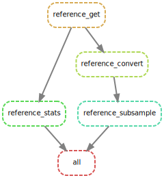

```{r setup, include=FALSE}
rm(list = ls()) ; invisible(gc()) ; set.seed(42)
library(knitr)
library(kableExtra)
if(knitr:::is_html_output()) options(knitr.table.format = "html") 
if(knitr:::is_latex_output()) options(knitr.table.format = "latex") 
library(tidyverse)
theme_set(bayesplot::theme_default())
opts_chunk$set(echo = F, message = F, warning = F, fig.height = 6, fig.width = 8,
               cache = T, cache.lazy = F)
```

Development of a [`singularity` & `snakemake`](https://github.com/sylvainschmitt/snakemake_singularity) workflow to generate *in silico* mutations.

# Summary

# Reference

## Get

## Statistics

```{r refStats}
read_tsv("results/data/reference.stats.txt", col_names = c("name", "length")) %>% 
  filter(grepl("Chr", name)) %>% 
  mutate(sel = ifelse(name == yaml::read_yaml("config/config.yml")$chromosome, 1, 0)) %>% 
  ggplot(aes(name, length/10^6, fill = as.factor(sel))) + 
  geom_col() +
  coord_flip() +
  xlab("Chromosome") +
  ylab("Mb") +
  scale_fill_manual("Selected", values = c("grey", "darkblue"))
```

## Convert

## Index

## Subsample

# All

```{bash, eval=F, echo=T}
snakemake -np 
snakemake --dag | dot -Tsvg > workflow/dag.svg
snakemake --use-singularity
snakemake --report workflow/report.html
```

**[Link to the report](https://github.com/sylvainschmitt/generateMutations/blob/main/workflow/report.html)**

```{r}

```


