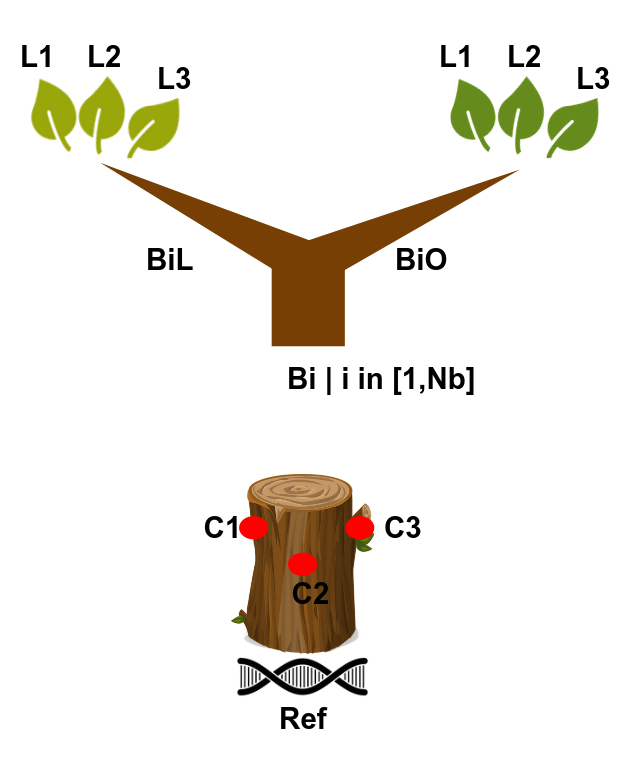

```{r setup, include=FALSE}
rm(list = ls()) ; invisible(gc()) ; set.seed(42)
library(knitr)
library(kableExtra)
if(knitr:::is_html_output()) options(knitr.table.format = "html") 
if(knitr:::is_latex_output()) options(knitr.table.format = "latex") 
library(tidyverse)
theme_set(bayesplot::theme_default())
opts_chunk$set(echo = F, message = F, warning = F, fig.height = 6, fig.width = 8,
               cache = F, cache.lazy = F)
```

[`singularity` & `snakemake`](https://github.com/sylvainschmitt/snakemake_singularity) workflow to generate *in silico* mutations corresponding to Angela sampling scheme.

```{r dag}
knitr::include_graphics("dag/dag.minimal.svg")
```

# Sampling scheme

```{r sampling}

```

# Installation

- [x] Python ≥3.5
- [x] Snakemake ≥5.24.1
- [x] Golang ≥1.15.2
- [x] Singularity ≥3.7.3
- [x] This workflow

```{bash, eval=F, echo=T}
# Python
sudo apt-get install python3.5
# Snakemake
sudo apt install snakemake`
# Golang
export VERSION=1.15.8 OS=linux ARCH=amd64  # change this as you need
wget -O /tmp/go${VERSION}.${OS}-${ARCH}.tar.gz https://dl.google.com/go/go${VERSION}.${OS}-${ARCH}.tar.gz && \
sudo tar -C /usr/local -xzf /tmp/go${VERSION}.${OS}-${ARCH}.tar.gz
echo 'export GOPATH=${HOME}/go' >> ~/.bashrc && \
echo 'export PATH=/usr/local/go/bin:${PATH}:${GOPATH}/bin' >> ~/.bashrc && \
source ~/.bashrc
# Singularity
mkdir -p ${GOPATH}/src/github.com/sylabs && \
  cd ${GOPATH}/src/github.com/sylabs && \
  git clone https://github.com/sylabs/singularity.git && \
  cd singularity
git checkout v3.7.3
cd ${GOPATH}/src/github.com/sylabs/singularity && \
  ./mconfig && \
  cd ./builddir && \
  make && \
  sudo make install
# generate Mutations
git clone git@github.com:sylvainschmitt/generateMutations.git
cd generateMutations
```

# Usage

## Get data

*Data from http://urgi.versailles.inra.fr/download/oak.*

```{bash, eval=F, echo=T}
cd data
bash get_data.sh
```

## Locally

```{bash, eval=F, echo=T}
snakemake -np -j 3 --resources mem_mb=10000 # dry run
snakemake --dag | dot -Tsvg > dag/dag.svg # dag
snakemake --use-singularity -j 3 --resources mem_mb=10000 # run
```

## HPC

```{bash, eval=F, echo=T}
module load bioinfo/snakemake-5.25.0 # for test on node
snakemake -np # dry run
sbatch job.sh # run
snakemake --dag | dot -Tsvg > dag/dag.svg # dag
```

# Workflow

## Cambiums

### [cp_ref](https://github.com/sylvainschmitt/generateMutations/blob/angela/rules/cp_ref.smk)

* Tools: `cp`
* Parameters:
    * sequence: `r yaml::read_yaml("config/config.dag.yml")$sequence`
    
### [vcf2model](https://github.com/sylvainschmitt/generateMutations/blob/angela/rules/vcf2model.smk)

* Tools: [`simuG`](https://github.com/yjx1217/simuG)
* Script: `vcf2model.pl`
* Parameters:
    * hz: `r yaml::read_yaml("config/config.dag.yml")$hz`

### [simug](https://github.com/sylvainschmitt/generateMutations/blob/angela/rules/simug.smk)

* Tools: [`simuG`](https://github.com/yjx1217/simuG)
* Script: `simuG.pl`
* Parameters:
    * n_snps: `r yaml::read_yaml("config/config.dag.yml")$n_snps`

### [iss_cambium](https://github.com/sylvainschmitt/generateMutations/blob/angela/rules/iss_cambium.smk)

* Script: [`iss.sh`](https://bedtools.readthedocs.io/en/latest/content/scripts/iss.sh)
* Tools: [`insilicoseq`](https://insilicoseq.readthedocs.io/en/latest/)
* Singularity:  docker://hadrieng/insilicoseq:latest
* Parameters:
    * n_reads_cambium: `r yaml::read_yaml("config/config.dag.yml")$n_reads_cambium`
    
## Leaves

### [generate_mutations_branch](https://github.com/sylvainschmitt/generateMutations/blob/angela/rules/generate_mutations_branch.smk)

* Script: [`generate_mutations.R`](https://bedtools.readthedocs.io/en/latest/content/scripts/generate_mutations.R)
* Singularity:"https://github.com/sylvainschmitt/singularity-template/releases/download/0.0.1/sylvainschmitt-singularity-tidyverse-Biostrings.latest.sif"
* Parameters:
    * n_mut: `r yaml::read_yaml("config/config.dag.yml")$n_mut`
    * R: `r yaml::read_yaml("config/config.dag.yml")$R`
    
### [generate_mutations_tip](https://github.com/sylvainschmitt/generateMutations/blob/angela/rules/generate_mutations_branch_tip.smk)

* Script: [`generate_mutations.R`](https://bedtools.readthedocs.io/en/latest/content/scripts/generate_mutations.R)
* Singularity:"https://github.com/sylvainschmitt/singularity-template/releases/download/0.0.1/sylvainschmitt-singularity-tidyverse-Biostrings.latest.sif"
* Parameters:
    * n_mut: `r yaml::read_yaml("config/config.dag.yml")$n_mut`
    * R: `r yaml::read_yaml("config/config.dag.yml")$R`

### [iss_leaf](https://github.com/sylvainschmitt/generateMutations/blob/angela/rules/iss_leaf.smk)

* Script: [`iss.sh`](https://bedtools.readthedocs.io/en/latest/content/scripts/iss.sh)
* Tools: [`insilicoseq`](https://insilicoseq.readthedocs.io/en/latest/)
* Singularity:  docker://hadrieng/insilicoseq:latest
* Parameters:
    * n_reads_leaf_mutated: `r yaml::read_yaml("config/config.dag.yml")$n_reads_leaf_mutated`
    * n_reads_leaf_base: `r yaml::read_yaml("config/config.dag.yml")$n_reads_leaf_base`

# To do

- [ ] varying AF
- [ ] defined genetic distance between samples based on an architecture
