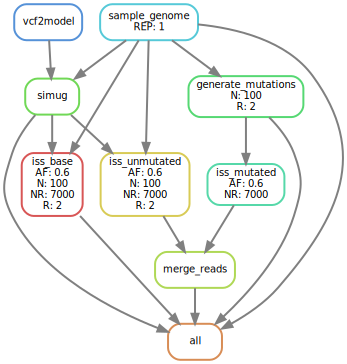

```{r setup, include=FALSE}
rm(list = ls()) ; invisible(gc()) ; set.seed(42)
library(knitr)
library(kableExtra)
if(knitr:::is_html_output()) options(knitr.table.format = "html") 
if(knitr:::is_latex_output()) options(knitr.table.format = "latex") 
library(tidyverse)
theme_set(bayesplot::theme_default())
opts_chunk$set(echo = F, message = F, warning = F, fig.height = 6, fig.width = 8,
               cache = F, cache.lazy = F)
```

[`singularity` & `snakemake`](https://github.com/sylvainschmitt/snakemake_singularity) workflow to generate *in silico* mutations.

```{r dagminimal}

```

```{r dag, eval=F}
knitr::include_graphics("dag/dag.svg")
```

# Installation

- [x] Python ≥3.5
- [x] Snakemake ≥5.24.1
- [x] Golang ≥1.15.2
- [x] Singularity ≥3.7.3
- [x] This workflow

```{bash, eval=F, echo=T}
# Python
sudo apt-get install python3.5
# Snakemake
sudo apt install snakemake`
# Golang
export VERSION=1.15.8 OS=linux ARCH=amd64  # change this as you need
wget -O /tmp/go${VERSION}.${OS}-${ARCH}.tar.gz https://dl.google.com/go/go${VERSION}.${OS}-${ARCH}.tar.gz && \
sudo tar -C /usr/local -xzf /tmp/go${VERSION}.${OS}-${ARCH}.tar.gz
echo 'export GOPATH=${HOME}/go' >> ~/.bashrc && \
echo 'export PATH=/usr/local/go/bin:${PATH}:${GOPATH}/bin' >> ~/.bashrc && \
source ~/.bashrc
# Singularity
mkdir -p ${GOPATH}/src/github.com/sylabs && \
  cd ${GOPATH}/src/github.com/sylabs && \
  git clone https://github.com/sylabs/singularity.git && \
  cd singularity
git checkout v3.7.3
cd ${GOPATH}/src/github.com/sylabs/singularity && \
  ./mconfig && \
  cd ./builddir && \
  make && \
  sudo make install
# generate Mutations
git clone git@github.com:sylvainschmitt/generateMutations.git
cd generateMutations
```

# Usage

## Get data

*Data from http://urgi.versailles.inra.fr/download/oak.*

```{bash, eval=F, echo=T}
cd data
bash get_data.sh
```

## Locally

```{bash, eval=F, echo=T}
snakemake -np # dry run
snakemake --dag | dot -Tsvg > dag/dag.svg # dag
snakemake --use-singularity --cores 4 # run
snakemake --use-singularity --cores 1 --verbose # debug
snakemake --report report.html # report
```

## HPC

```{bash, eval=F, echo=T}
module purge ; module load bioinfo/snakemake-5.25.0 # for test on node
snakemake -np # dry run
sbatch job.sh ; watch 'squeue -u sschmitt' # run
less genMut.*.err # snakemake outputs, use MAJ+F
less genMut.*.out # snakemake outputs, use MAJ+F
snakemake --dag | dot -Tsvg > dag/dag.svg # dag
module purge ; module load bioinfo/snakemake-5.25.0 ; module load system/Python-3.6.3 # for report
snakemake --report report.html # report
```

# Workflow

## Reference

### [samtools_faidx](https://github.com/sylvainschmitt/generateMutations/blob/main/rules/samtools_faidx.smk)

* Tools: [`samtools faidx`](http://www.htslib.org/doc/samtools-faidx.html)
* Singularity: oras://registry.forgemia.inra.fr/gafl/singularity/samtools/samtools:latest
* Parameters:
    * Chromosome: `r yaml::read_yaml("config/config.dag.yml")$chr`
    
### [vcf2model](https://github.com/sylvainschmitt/generateMutations/blob/main/rules/vcf2model.smk)

* Tools: [`simuG`](https://github.com/yjx1217/simuG)
* Script: `vcf2model.pl`

### [simug](https://github.com/sylvainschmitt/generateMutations/blob/main/rules/simug.smk)

* Tools: [`simuG`](https://github.com/yjx1217/simuG)
* Script: `simuG.pl`

## Mutations

### [generate_mutations](https://github.com/sylvainschmitt/generateMutations/blob/main/rules/generate_mutations.smk)

* Script: [`generate_mutations.R`](https://bedtools.readthedocs.io/en/latest/content/scripts/generate_mutations.R)
* Singularity:"https://github.com/sylvainschmitt/singularity-template/releases/download/0.0.1/sylvainschmitt-singularity-tidyverse-Biostrings.latest.sif"
* Parameters:
    * Number: `r yaml::read_yaml("config/config.dag.yml")$n_mut`
    * Transition/Transversion ratio R (see below): `r yaml::read_yaml("config/config.dag.yml")$R`

```{r R}
include_graphics("https://dridk.me/images/post17/transition_transversion.png")
```

## Reads

### [iss_base](https://github.com/sylvainschmitt/generateMutations/blob/main/rules/iss_base.smk)

* Tools: [`insilicoseq`](https://insilicoseq.readthedocs.io/en/latest/)
* Singularity:  docker://hadrieng/insilicoseq:latest
* Parameters:
    * Allele frequency: `r yaml::read_yaml("config/config.dag.yml")$AF`
    * Number of reads: `r yaml::read_yaml("config/config.dag.yml")$n_reads`

### [iss_mutated](https://github.com/sylvainschmitt/generateMutations/blob/main/rules/iss_mutated.smk)

* Tools: [`insilicoseq`](https://insilicoseq.readthedocs.io/en/latest/)
* Singularity:  docker://hadrieng/insilicoseq:latest
* Parameters:
    * Allele frequency: `r yaml::read_yaml("config/config.dag.yml")$AF`
    * Number of reads: `r yaml::read_yaml("config/config.dag.yml")$n_reads`

### [merge_reads](https://github.com/sylvainschmitt/generateMutations/blob/main/rules/merge_reads.smk)

* Tools: `cat`

# Results

```{r }
read_tsv(list.files("results/mutations/", pattern = ".tsv", full.names = T)[1]) %>% 
  select(CHROM, POS, REF, ALT, TYPE) %>% 
  arrange(CHROM, POS, REF, ALT) %>%
  sample_n(10) %>%  
  kable(col.names = c("Chromosome", "Position", "Reference", "Alternative", "Type"),
        caption = "Generated mutations.")
```


<!-- ## Resources -->

<!-- * [TreeMutation pages](https://treemutation.netlify.app/mutations-detection.html#in-silico-mutations) -->
<!-- * [genologin skanemake template](https://forgemia.inra.fr/bios4biol/workflows/-/tree/06c6a5cb3206a594f9a535ba8d3df3e64682a8bc/Snakemake/template_dev) -->
<!-- * [Oak genome A4 snakemake](https://forgemia.inra.fr/genome_a4/genome_a4) -->
<!-- * [singularity images from forgemia](https://forgemia.inra.fr/gafl/singularity) -->
<!-- * [biocontainers](https://biocontainers.pro/tools/bioconductor-biostrings) -->

<!-- * https://forgemia.inra.fr/adminforgemia/doc-public/-/wikis/Gitlab-Container-Registry -->
<!-- * https://souchal.pages.in2p3.fr/hugo-perso/2019/09/20/tutorial-singularity-and-docker/ -->

<!-- * https://github.com/ShixiangWang/sigminer -->
<!-- * https://github.com/ShixiangWang/sigflow -->
<!-- * https://github.com/FunGeST/Palimpsest -->
<!-- * https://github.com/IARCbioinfo/needlestack -->
<!-- * https://github.com/luntergroup/octopus -->
<!-- * https://github.com/G3viz/g3viz -->
