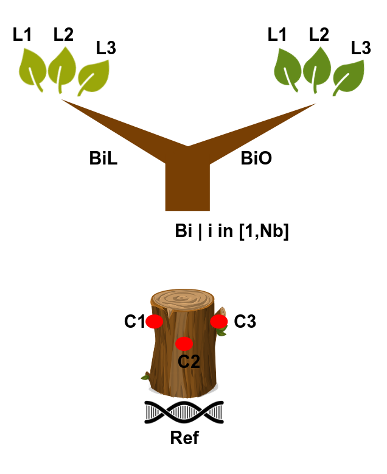

generate Mutations - Angela
================
Sylvain Schmitt
Jully 16, 2021

  - [Sampling scheme](#sampling-scheme)
  - [Installation](#installation)
  - [Usage](#usage)
      - [Get data](#get-data)
      - [Locally](#locally)
      - [HPC](#hpc)
  - [Workflow](#workflow)
      - [Cambiums](#cambiums)
      - [Leaves](#leaves)
  - [To do](#to-do)

[`singularity` &
`snakemake`](https://github.com/sylvainschmitt/snakemake_singularity)
workflow to generate *in silico* mutations corresponding to Angela
sampling scheme.

<!-- -->

# Sampling scheme



# Installation

  - [x] Python ≥3.5
  - [x] Snakemake ≥5.24.1
  - [x] Golang ≥1.15.2
  - [x] Singularity ≥3.7.3
  - [x] This workflow

<!-- end list -->

``` bash
# Python
sudo apt-get install python3.5
# Snakemake
sudo apt install snakemake`
# Golang
export VERSION=1.15.8 OS=linux ARCH=amd64  # change this as you need
wget -O /tmp/go${VERSION}.${OS}-${ARCH}.tar.gz https://dl.google.com/go/go${VERSION}.${OS}-${ARCH}.tar.gz && \
sudo tar -C /usr/local -xzf /tmp/go${VERSION}.${OS}-${ARCH}.tar.gz
echo 'export GOPATH=${HOME}/go' >> ~/.bashrc && \
echo 'export PATH=/usr/local/go/bin:${PATH}:${GOPATH}/bin' >> ~/.bashrc && \
source ~/.bashrc
# Singularity
mkdir -p ${GOPATH}/src/github.com/sylabs && \
  cd ${GOPATH}/src/github.com/sylabs && \
  git clone https://github.com/sylabs/singularity.git && \
  cd singularity
git checkout v3.7.3
cd ${GOPATH}/src/github.com/sylabs/singularity && \
  ./mconfig && \
  cd ./builddir && \
  make && \
  sudo make install
# generate Mutations
git clone git@github.com:sylvainschmitt/generateMutations.git
cd generateMutations
```

# Usage

## Get data

*Data from <http://urgi.versailles.inra.fr/download/oak>.*

``` bash
cd data
bash get_data.sh
```

## Locally

``` bash
snakemake -np -j 3 --resources mem_mb=10000 # dry run
snakemake --dag | dot -Tsvg > dag/dag.svg # dag
snakemake --use-singularity -j 3 --resources mem_mb=10000 # run
```

## HPC

``` bash
module load bioinfo/snakemake-5.25.0 # for test on node
snakemake -np # dry run
sbatch job.sh # run
snakemake --dag | dot -Tsvg > dag/dag.svg # dag
```

# Workflow

## Cambiums

### [cp\_ref](https://github.com/sylvainschmitt/generateMutations/blob/angela/rules/cp_ref.smk)

  - Tools: `cp`
  - Parameters:
      - sequence: Qrob\_PM1N\_7k

### [vcf2model](https://github.com/sylvainschmitt/generateMutations/blob/angela/rules/vcf2model.smk)

  - Tools: [`simuG`](https://github.com/yjx1217/simuG)
  - Script: `vcf2model.pl`
  - Parameters:
      - hz: siteshz3P.vcf

### [simug](https://github.com/sylvainschmitt/generateMutations/blob/angela/rules/simug.smk)

  - Tools: [`simuG`](https://github.com/yjx1217/simuG)
  - Script: `simuG.pl`
  - Parameters:
      - n\_snps: 70

### [iss\_cambium](https://github.com/sylvainschmitt/generateMutations/blob/angela/rules/iss_cambium.smk)

  - Script:
    [`iss.sh`](https://bedtools.readthedocs.io/en/latest/content/scripts/iss.sh)
  - Tools:
    [`insilicoseq`](https://insilicoseq.readthedocs.io/en/latest/)
  - Singularity: docker://hadrieng/insilicoseq:latest
  - Parameters:
      - n\_reads\_cambium: 9333

## Leaves

### [generate\_mutations\_branch](https://github.com/sylvainschmitt/generateMutations/blob/angela/rules/generate_mutations_branch.smk)

  - Script:
    [`generate_mutations.R`](https://bedtools.readthedocs.io/en/latest/content/scripts/generate_mutations.R)
  - Singularity:“<https://github.com/sylvainschmitt/singularity-template/releases/download/0.0.1/sylvainschmitt-singularity-tidyverse-Biostrings.latest.sif>”
  - Parameters:
      - n\_mut: 5
      - R: 2

### [generate\_mutations\_tip](https://github.com/sylvainschmitt/generateMutations/blob/angela/rules/generate_mutations_branch_tip.smk)

  - Script:
    [`generate_mutations.R`](https://bedtools.readthedocs.io/en/latest/content/scripts/generate_mutations.R)
  - Singularity:“<https://github.com/sylvainschmitt/singularity-template/releases/download/0.0.1/sylvainschmitt-singularity-tidyverse-Biostrings.latest.sif>”
  - Parameters:
      - n\_mut: 5
      - R: 2

### [iss\_leaf](https://github.com/sylvainschmitt/generateMutations/blob/angela/rules/iss_leaf.smk)

  - Script:
    [`iss.sh`](https://bedtools.readthedocs.io/en/latest/content/scripts/iss.sh)
  - Tools:
    [`insilicoseq`](https://insilicoseq.readthedocs.io/en/latest/)
  - Singularity: docker://hadrieng/insilicoseq:latest
  - Parameters:
      - n\_reads\_leaf\_mutated: 280
      - n\_reads\_leaf\_base: 653

# To do

  - [ ] varying AF
  - [ ] defined genetic distance between samples based on an
    architecture
