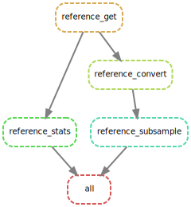

generate Mutations
================
Sylvain Schmitt
April 20, 2021

  - [Summary](#summary)
  - [Reference](#reference)
      - [Get](#get)
      - [Statistics](#statistics)
      - [Convert](#convert)
      - [Index](#index)
      - [Subsample](#subsample)
  - [All](#all)

Development of a [`singularity` &
`snakemake`](https://github.com/sylvainschmitt/snakemake_singularity)
workflow to generate *in silico* mutations.

# Summary

# Reference

## Get

## Statistics

<!-- -->

## Convert

## Index

## Subsample

# All

``` bash
snakemake -np 
snakemake --dag | dot -Tsvg > workflow/dag.svg
snakemake --use-singularity
snakemake --report workflow/report.html
```

**[Link to the
report](https://github.com/sylvainschmitt/generateMutations/blob/main/workflow/report.html)**

<!-- -->
