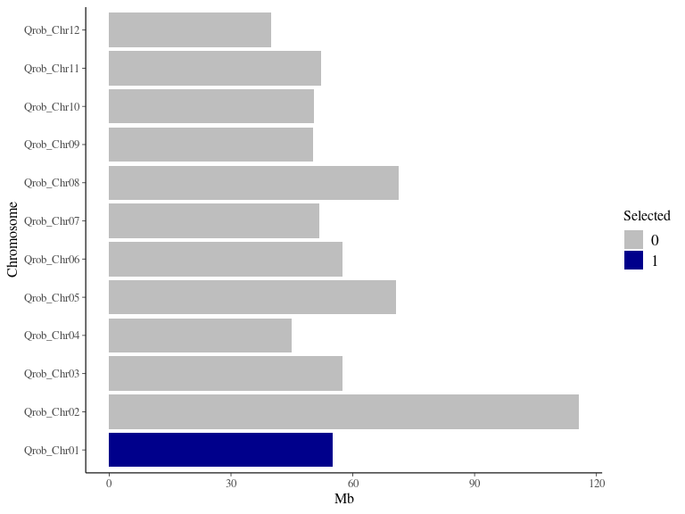
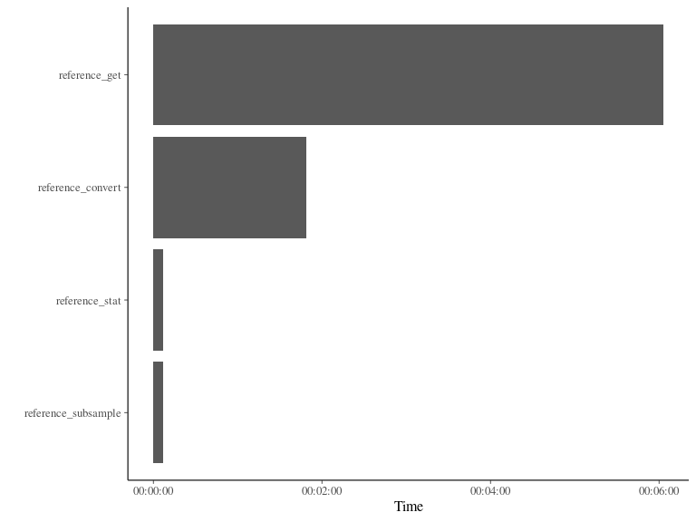

generate Mutations
================
Sylvain Schmitt
April 20, 2021

  - [Summary](#summary)
  - [Data](#data)
      - [Get genome](#get-genome)
      - [Chromosmes length](#chromosmes-length)
      - [Sample reference](#sample-reference)
  - [Reads](#reads)
      - [Uncompress reference](#uncompress-reference)
      - [Generate reads](#generate-reads)
      - [Split reads](#split-reads)
  - [Mutations](#mutations)
      - [Generate mutations](#generate-mutations)
  - [All](#all)
      - [Commands](#commands)
      - [DAG](#dag)
      - [Benchamrk](#benchamrk)
  - [Resources](#resources)
      - [GitHub](#github)
  - [References](#references)

Development of a [`singularity` &
`snakemake`](https://github.com/sylvainschmitt/snakemake_singularity)
workflow to generate *in silico* mutations.

# Summary

# Data

## Get genome

From <https://urgi.versailles.inra.fr/download/oak/Qrob_PM1N.fa.gz>
using `wget`.

## Chromosmes length

Using `bioawk`.

<!-- -->

## Sample reference

Using `seqkit gep`.
[Help](https://bioinf.shenwei.me/seqkit/usage/#grep).

# Reads

## Uncompress reference

For `insilicoseq` using `gzip`.

## Generate reads

Using `insilicoseq`.
[Help](https://insilicoseq.readthedocs.io/en/latest/iss/generate.html#full-list-of-options).

## Split reads

Using `seqkit split2` and `mv`.
[Help](https://bioinf.shenwei.me/seqkit/usage/#split2).

# Mutations

## Generate mutations

How?

  - Using `SomaticSpike`.
  - Using script `mutate.py` on the reference and generating again reads
    to be mixde for mutation frequency
  - Using [`msbar` from
    `EMBOSS`](http://emboss.sourceforge.net/apps/release/6.4/emboss/apps/msbar.html)
    with previous strategy

# All

## Commands

``` bash
snakemake -np 
snakemake --dag | dot -Tsvg > dag/dag.svg
snakemake --use-singularity
snakemake --report results/report.html
```

## DAG

<!-- -->

## Benchamrk

<!-- -->

# Resources

  - [TreeMutation
    pages](https://treemutation.netlify.app/mutations-detection.html#in-silico-mutations)
  - [genologin skanemake
    template](https://forgemia.inra.fr/bios4biol/workflows/-/tree/06c6a5cb3206a594f9a535ba8d3df3e64682a8bc/Snakemake/template_dev)
  - [Oak genome A4
    snakemake](https://forgemia.inra.fr/genome_a4/genome_a4)
  - [singularity images from
    forgemia](https://forgemia.inra.fr/gafl/singularity)

## GitHub

  - <https://github.com/ShixiangWang/sigminer>
  - <https://github.com/ShixiangWang/sigflow>
  - <https://github.com/FunGeST/Palimpsest>
  - <https://github.com/IARCbioinfo/needlestack>
  - <https://github.com/luntergroup/octopus>
  - <https://github.com/G3viz/g3viz>

# References
